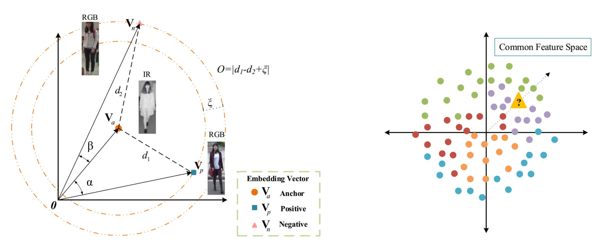
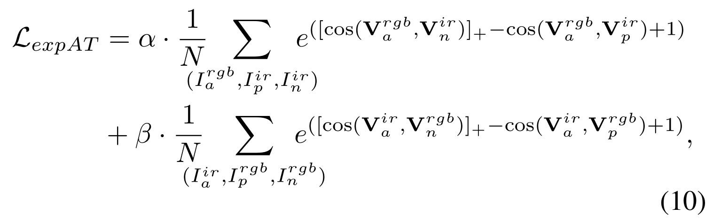

# expAT: Bi-directional Exponential Angular Triplet Loss for RGB-Infrared Person Re-Identification
 


[arXiv page](https://arxiv.org/abs/2006.00878)

Most existing works use Euclidean metric based constraints to resolve the discrepancy between features of different modalities. However, these methods are incapable of learning angularly discriminative feature embedding because Euclidean distance cannot measure the included angle between embedding vectors effectively. 

As an angularly discriminative feature space is important for a stable feature space, and also important for the classification branch in training as pointed out in the paper, we **abandon the Euclidean metric based loss function and propose a novel ranking loss function, named Bi-directional Exponential Angular Triplet Loss, to help learn an angularly separable common feature space by explicitly constraining the included angles between embedding vectors.** The proposed Exponential Angular Triplet (expAT) Loss is formulated as:
 

Moreover, to help stabilize and learn the magnitudes of embedding vectors, we adopt a common space batch normalization layer, which is a variant of batch normalization, to recalibrate feature generated by the backbone model. 

Quantitative experiments on the SYSU-MM01 and RegDB dataset support our analysis. On SYSU-MM01 dataset, the performance is improved from 7.40% / 11.46% to 38.57% / 38.61% for rank-1 accuracy / mAP compared with the baseline. The proposed method can be generalized to the task of single-modality Re-ID and improves the rank-1 accuracy / mAP from 92.0% / 81.7% to 94.7% / 86.6% on the Market-1501 dataset, from 82.6% / 70.6% to 87.6% / 77.1% on the DukeMTMC-reID dataset.

## Prerequisite
- Python>=3.6
- Pytorch>=1.0.0
- Opencv>=3.1.0
- tensorboard-pytorch

## Experiments on the RGB-IR Re-ID (SYSU-MM01)

## RGB-IR Re-ID Codes
The related codes are located at "rgbir_exp/codes". Before using them, you need to adjust the dataset and pretrained-model paths in "settings.py". 

- Training: ```python main.py -a train``` 
- Testing:  ```python main.py -a test -m checkpoint_name -s test_setting```

The test settings of SYSU-MM01 include: "all_multi" (all search mode, multi-shot), "all_single"  (all search mode, single-shot), "indoor_multi"  (indoor search mode, multi-shot), "indoor_single"  (indoor search mode, single-shot).

## Experiments on the SINGLE-MODALITY RGB Re-ID
As explained in the paper, the proposed expAT Loss can be easily implemented on the more popular RGB Re-ID problem. We validate the effectiveness of expAT Loss on two popular benchmarks: Market-1501 and DukeMTMC-reID datasets. 

| Algorithm          | Market-1501 (Top1/mAP)   |  DukeMTMC-reID (Top1/mAP)|
| ---                | ------------- | ------------- |
| Triplet Loss       | 92.0 (81.7) | 82.6 (70.6) |
| BNNeck             |  94.1 (85.7) | 86.2 (75.9)  |
| expAT Loss         | 94.7 (86.6)  | **87.6 (77.1)**  |
| expAT+Center Loss  |  **94.7 (86.8)** | 87.4 (76.9)  |

## RGB Re-ID Codes
The related codes of RGB Re-ID are located at "rgb_exp/codes", the implementation is based on a [strong baseline](https://github.com/michuanhaohao/reid-strong-baseline) by Hao Luo et al.

The four algorithms shown in the table above are all available on both datasets. Before running the scripts, you need to **set your data location in the scripts** and **set your pretrained model path in the configs/xxx.yml**
 
For example, to run the expAT Loss experiment on Market-1501 dataset, you need to:
```
bash Experiment-expAT-market.sh
```


# CITE ME
Our paper has been formally accepted by the IEEE Transactions on Image Processing. If you find our paper/codes useful, please kindly consider citing the paper:
```
@ARTICLE{expat,
    title={Bi-directional Exponential Angular Triplet Loss for RGB-Infrared Person Re-Identification},
    author={Hanrong Ye and Hong Liu and Fanyang Meng and Xia Li},
    year={2020},
    eprint={2006.00878},
    archivePrefix={arXiv},
    primaryClass={cs.CV}
}
```

# Related Links
A chinese "in a nutshelf" blog on zhihu: [Is the Euclidean Distance still the best choice for metric learning in cross-modality/single-modality Person Re-ID tasks? - zhihu](https://zhuanlan.zhihu.com/p/336482654)

# Contact:
Just raise an issue, or e-mail to Hanrong Ye: leoyhr AT pku.edu.cn

# License
[Creative commons license](https://creativecommons.org/licenses/by-nc/4.0/) which allows for personal and research use only. 
